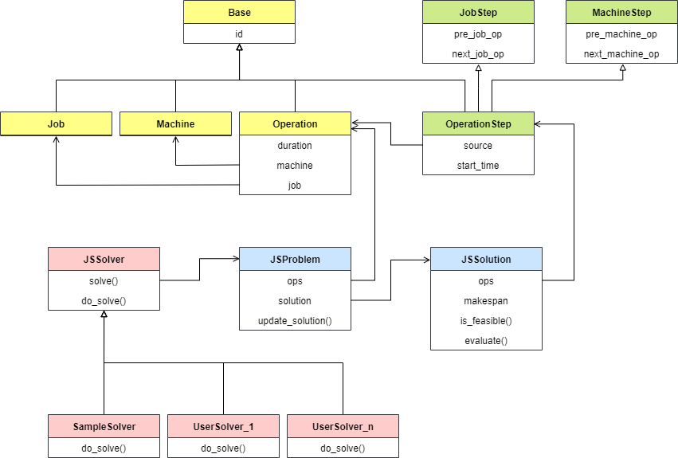

# Job-Shop Schedule Problem Solving Framework

A framework to implement and test algorithm for Job-Shop schedule problem (JSP).

- Test pre-defined solver

    - [x] Google OR-Tools Constrain Programming solver
    - [ ] PuLP
    - [x] Priority dispatching
    - [ ] Tabu search
    - [ ] Genetic algorithm 

- Implement and test your solver efficiently


## Installation

```python
python setup.py develop
```


## Test a built-in solver

Load a [benchmark problem]("jsp_fwk/benchmark/instances.json) and solve it with sample code below. A dynamic Gantt chart is shown during the solving process by default.

```python
from jsp_fwk import JSProblem
from jsp_fwk.solver import GoogleORCPSolver

# load benchmark problem
problem = JSProblem(benchmark='ft10')

# solve problem with user defined solver
s = GoogleORCPSolver()
s.solve(problem=problem)
```

## Implement a new solver

To develop your new solver, inherit from `JSSolver` and implement method `do_solver()`. Taking [sample/UserSolver](sample/UserSolver.py) for example, the general steps in `do_solver()`:

- Initialize an empty solution from problem

    ```python
    solution = JSSolution(problem)
    ```

- Solve or optimize the solution

    - either determine `start_time` of each operation directly with **mathematical model** of JSP; 
    - or determine the sequence of operations first and deduce `start_time` by `solution.evaluate()` with **disjunctive graph model** of JSP

- Update the solution for problem iteratively


```python
from jsp_fwk import (JSProblem, JSSolution, JSSolver)

class UserSolver(JSSolver):

    def do_solve(self, problem:JSProblem):
        '''User defined solving process.'''

        # (1) Initialize an empty solution from problem
        solution = JSSolution(problem)

        # (2) Solve or optimize the solution, 
        # i.e. determine the start_time of OperationStep instances.
        # Note to evaluate solution explicitly if disjunctive graph model.
        ...
        # solution.evaluate() 

        # (3) Update the solution for problem iteratively
        problem.update_solution(solution)
```


## Class Diagram

See the entire structure of this framework below.

- Problem facts

    - `Job`
    - `Machine`
    - `Operation`

- Solving variable

    `OperationStep` is a wrapper of `Operation` instance, combined with variable `start_time` to solve. One can solve `start_time` directly with the mathematical model of JSP, or solve the operation sequence first and deduce the `start_time` accordingly with disjunctive graph model of JSP.

    For solver based on disjunctive graph model,

    - properties inherited from `JobStep` define the sequence of operations belonging to the same `Job`, which is deterministic

    - properties inherited from `MachineStep` define the processing sequence of operations assigned to the same `Machine`, which is to be solved

- Solving process

    - `JSProblem` is a wrapper of problem fact, i.e. `Operation` instances

    - `JSSolution` is a wrapper of variable, i,e, `OperationStep` instances

    - `JSSolver` implements the algorithm to construct a `JSSolution` for specified `JSProblem`





## License

The project is licensed under the terms of the Apache License 2.0.