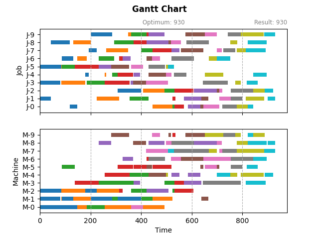

# Job-Shop Schedule Problem Solving Framework

A framework to explore algorithms for Job-Shop Schedule Problem (JSSP).

- Pre-defined solvers for benchmark.

    - [x] Google [OR-Tools](https://github.com/google/or-tools) Constraint Programming solver
    - [x] Mathematical solvers (CBC, SCIP, Gurobi) based on COIN-OR [PuLP](https://github.com/coin-or/pulp)
    - [x] Priority dispatching
    - [ ] Tabu search
    - [ ] Genetic algorithm 
    - [ ] Reinforcement learning

- Implement and test your solver efficiently.



## Problem description

According to the problem description [here](https://acrogenesis.com/or-tools/documentation/user_manual/manual/ls/jobshop_def_data.html#description-of-the-problem):

> In the classical Job-Shop Schedule Problem, there are $n$ jobs that must be processed on $m$ machines. Each job consists of a sequence of different tasks. Each task needs to be processed during an uninterrupted period of time on a given machine.

In general, JSSP can be modeled in direct or indirect ways, i.e., **mathematical model**, and **disjunctive graph**.

- mathematical model - take `start_time` of each task as variable and solve it directly;
- disjunctive graph - solve the sequence of tasks assigned in each machine first and deduce `start_time` accordingly.

A detailed description in Chinese [here](https://dothinking.github.io/2021-08-08-作业车间调度问题求解框架：问题描述).


## Installation

```python
python setup.py develop
```

## Documentation

- [Load or create a problem](./doc/1-load-problem.ipynb)
- [Solve problem with built-in solver](./doc/2-solve-problem.ipynb)
- [Build new solver](./doc/3-build-solver.ipynb)
- [Run solvers benchmark](./doc/4-run-benchmark.ipynb)
- [Class diagram](./doc/class_diagram.md)


## License

The project is licensed under the terms of the Apache License 2.0.