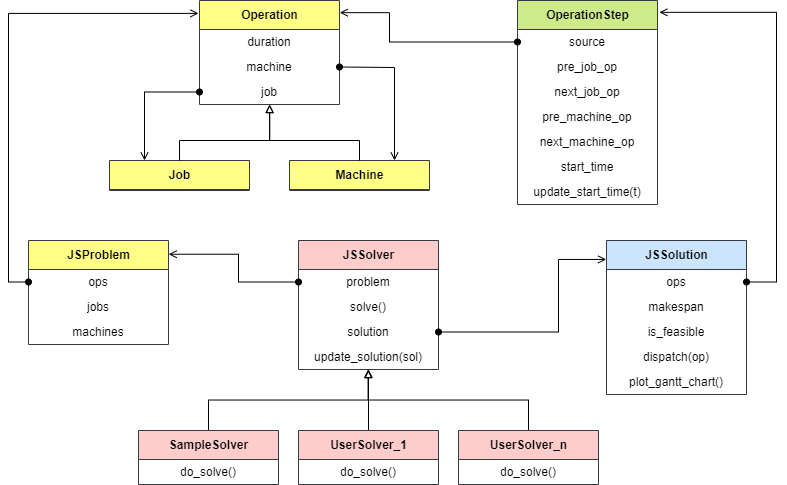

# Class Diagram

See the entire structure of this library below.

## Problem facts

- `Job`
- `Machine`
- `Operation` is a step of a certain job to be processed on specified machine.
- `JSProblem` is a wrapper of problem fact, i.e., `Operation` instances.

## Variable

- `OperationStep` is a wrapper of `Operation` instance, combined with variable `start_time` to solve.

## Solver and solution

- `JSSolver` implements algorithm to get a solution for specified problem.
- `JSSolution` is a wrapper of variable, i.e., `OperationStep` instances.

## Class diagram

